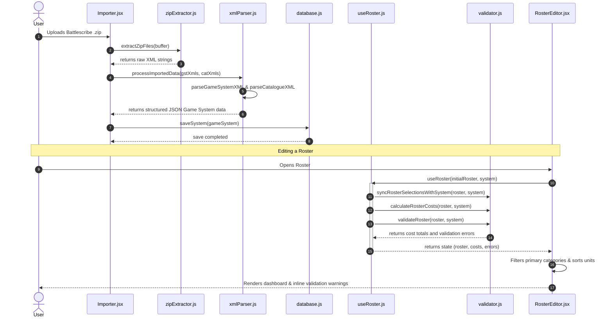

# Comprehensive Architecture, Testability, and Extensibility Review Report

## Executive Summary
This report presents a comprehensive review of the Tabletop army list builder application's codebase (`src/` directory). The application operates on React/Vite, using IndexedDB for local persistence. It is designed to parse Battlescribe XML catalog data, validate army rosters against dynamic rules/modifiers, and offer interactive editing and battlefield play capabilities.

The codebase is highly functional, successfully implementing complex Battlescribe concepts such as collective options, variable scope constraints, and cross-catalog dependencies. However, there are significant opportunities for architectural cleanup, test consolidation, and decoupling of core systems.

Key findings include:
- **Architectural Bloat**: Several components exceed 400 lines of code, mixing UI rendering, state synchronization, and core validation logic.
- **Testing Fragmentation**: Tests are split between a plain Node script environment and Vitest, using inconsistent assertion styles and duplicating code.
- **High Coupling**: UI modules directly inject third-party CDN libraries and make direct external API calls. Business hooks are directly bound to browser-only IndexedDB.

---

## 1. Architecture Analysis

### Module Dependency Graph

```mermaid
graph TD
    App[src/App.jsx] --> DB[src/db/database.js]
    App --> Mig[src/db/migrations.js]
    App --> DebugCtx[src/hooks/DebugContext.jsx]
    App --> Importer[src/components/Importer.jsx]
    App --> RosterEd[src/components/RosterEditor.jsx]
    App --> Play[src/components/PlayMode.jsx]
    App --> DebugModal[src/components/editor/DebugEntryEditorModal.jsx]
    App --> PDFRules[src/parser/pdfRulesExtractor.js]

    Importer --> DB
    Importer --> Zip[src/parser/zipExtractor.js]
    Importer --> XML[src/parser/xmlParser.js]
    Importer --> SysEd[src/components/importer/SystemEditorView.jsx]

    SysEd --> DB
    SysEd --> PDFRules
    SysEd --> XML
    SysEd --> DebugCtx

    RosterEd --> useRoster[src/hooks/useRoster.js]
    RosterEd --> DebugCtx
    RosterEd --> Val[src/solver/validator.js]
    RosterEd --> Const[src/solver/constants.js]
    RosterEd --> UnitAdd[src/components/editor/CategoryUnitAdder.jsx]
    RosterEd --> Sidebar[src/components/editor/RosterSidebar.jsx]
    RosterEd --> Config[src/components/editor/SelectionConfigurator.jsx]

    useRoster --> DB
    useRoster --> Val

    Play --> DB
    Play --> Val
    Play --> DebugCtx
    Play --> Const
    Play --> RulesEval[src/solver/rulesEvaluator.js]
    Play --> Bottom[src/components/editor/BottomSheet.jsx]

    Config --> Val
    Config --> Opts[src/solver/optionsCollector.js]
    Config --> Bottom
    Config --> DebugCtx
    Config --> Const

    Opts --> Val
    RulesEval --> Const
    UnitAdd --> Val
    Sidebar --> Val
    DebugModal --> Val
    DebugModal --> PDFRules
```



### Breakdown of Files Exceeding 400 LOC

#### 1. `src/solver/validator.js` (803 LOC)
- **Responsibilities**: Contains the primary rules validation engine. Handles catalog caching/lookups (`findEntryInSystem`), entry link resolution, cost calculations, constraint/modifier evaluation, active selection counting, and validation report aggregation.
- **Decomposition Recommendation**:
  - Extract the indexing and lookup mechanism into `src/solver/catalogResolver.js` (e.g. lines 1–144).
  - Extract condition evaluation and modifier logic into `src/solver/modifierEvaluator.js` (e.g. lines 261–353).
  - Extract the counting logic into `src/solver/rosterCounter.js` (e.g. lines 355–418).
  - Keep the core validator coordination in `src/solver/validator.js` (e.g. lines 423–710).

#### 2. `src/components/editor/SelectionConfigurator.jsx` (767 LOC)
- **Responsibilities**: View component for editing a unit's sub-selections. Collects available options, groups them by categories, handles constraints (checkboxes vs. radio groups), and validates availability against roster-wide uniqueness rules.
- **Decomposition Recommendation**:
  - Move the sub-component `OptionGroupComponent` (lines 348–767) into its own file (`src/components/editor/OptionGroup.jsx`).
  - Extract the unique option check logic (`isUniqueOptionTakenElsewhere`, lines 387–413) to a utility helper inside `src/solver/optionsCollector.js`.

#### 3. `src/components/RosterEditor.jsx` (717 LOC)
- **Responsibilities**: Main list-building UI. Handles category listings, toggling secondary rule tags, displaying catalog profiles and rule details, and coordinating unit lists.
- **Decomposition Recommendation**:
  - Extract the unit card element (lines 471–561) into `src/components/editor/UnitSelectionCard.jsx`.
  - Extract the stat-block modal panel (lines 314–363) into `src/components/editor/CatalogStatBlock.jsx`.

#### 4. `src/components/PlayMode.jsx` (690 LOC)
- **Responsibilities**: Renders the in-game dashboard. Manages VP, rounds, CP, and wound state tracking. Dynamically evaluates armor and ward saves on the fly by querying rules text.
- **Decomposition Recommendation**:
  - Extract play state logic into a custom hook `src/hooks/usePlayState.js`.
  - Extract the collapsible rules card rendering (lines 514–642) into a sub-component `src/components/play/PlayUnitDetails.jsx`.

#### 5. `src/App.jsx` (614 LOC)
- **Responsibilities**: Orchestrator of the top-level application state. Manages active views, global database sync, runs schema migrations, handles new roster forms, and injects debug search/click interceptors.
- **Decomposition Recommendation**:
  - Move `GlobalDebugSearch` (lines 13–69) into a separate component `src/components/editor/GlobalDebugSearch.jsx`.
  - Extract the new roster modal dialog (lines 505–584) into `src/components/editor/NewRosterModal.jsx`.

#### 6. `src/parser/pdfRulesExtractor.js` (594 LOC)
- **Responsibilities**: Multi-purpose utility. Combines catalog querying, page range parsing, Gemini Vision API client connections, and DOM-based XML node updates.
- **Decomposition Recommendation**:
  - Move the Gemini Flash Vision integration (`runVisionAnalysis`, lines 123–173) and pdf text rendering into `src/parser/visionClient.js`.
  - Extract the DOM XML editing method (`updateRawXml`, lines 175–232) into `src/parser/xmlMutator.js`.
  - Extract search helpers (`searchEditableEntries`, lines 322–459) to a dedicated `src/solver/catalogQuery.js` file.

#### 7. `src/solver/ui.test.js` (534 LOC)
- **Responsibilities**: Integrates programmatically packing catalog files, starting the Vite local development process, wiping IndexedDB in Puppeteer, and simulating builder/mobile UI steps.
- **Decomposition Recommendation**:
  - Move the catalog packing setup (lines 12–39) and server spawner (lines 42–84) to a dedicated test helper file.
  - Split test blocks into feature E2E specs (e.g. `import.test.js`, `builder.test.js`, `mobile.test.js`).

#### 8. `src/components/importer/SystemEditorView.jsx` (424 LOC)
- **Responsibilities**: Interface for manual catalog editing and vision auto-scanning. Manages pdf file uploads, renders pdf pages on a canvas element, and injects scripts dynamically.
- **Decomposition Recommendation**:
  - Separate the automatic scanner view (lines 291–420) from the manual input forms.
  - Extract script injection logic (lines 50–65) into a custom utility hook `src/hooks/useExternalScript.js`.

#### 9. `src/parser/xmlParser.js` (423 LOC)
- **Responsibilities**: Performs translation of Battlescribe XML structures (nodes, attributes, nested loops) into clean JavaScript objects representing game systems and catalog lists.
- **Decomposition Recommendation**:
  - Split into parsing modules: `src/parser/parseGst.js` (game system parser) and `src/parser/parseCat.js` (catalogue parser).
  - Extract the modifier/repeat parser loops (lines 133–176) to isolate testing of condition groups.

---

### Data Flow Diagram

The diagram below details the data flow from the initial upload of zipped XML catalog data, through database storage, and finally into the validation loop and UI rendering:



---

### Coupling Issues Analysis

#### 1. In-Component Dynamic External Script Injection
- **Location**: `src/components/importer/SystemEditorView.jsx` (Lines 50–65)
- **Code**:
  ```javascript
  const script = document.createElement('script');
  script.src = 'https://cdnjs.cloudflare.com/ajax/libs/pdf.js/3.11.174/pdf.min.js';
  script.onload = () => {
    window.pdfjsLib.GlobalWorkerOptions.workerSrc = 'https://cdnjs.cloudflare.com/ajax/libs/pdf.js/3.11.174/pdf.worker.min.js';
    resolve(window.pdfjsLib);
  };
  ```
- **Consequence**: Tightly couples the React UI view to external CDN network availability and global `window` browser namespace states. It breaks unit-testing capabilities in headless/non-browser test configurations.

#### 2. Network Client Logic Embedded in Rules Extractor Utilities
- **Location**: `src/parser/pdfRulesExtractor.js` (Lines 125–173)
- **Code**:
  ```javascript
  export async function runVisionAnalysis(apiKey, base64Image, catalogueEntries) {
    const url = `https://generativelanguage.googleapis.com/v1beta/models/gemini-2.5-flash:generateContent?key=${apiKey}`;
    const response = await fetch(url, { ... });
  ```
- **Consequence**: The XML rules extraction parser utility is directly coupled to Google Gemini's endpoint routing, HTTP client connections, and API schema definitions. This violates separation of concerns.

#### 3. Duplicate Implementation of Core Business Logic in Tests
- **Location**: `src/solver/validator.test.js` (Lines 377–422 and 425–502)
- **Code**:
  ```javascript
  const updateRawXmlTest = (system, entryId, type, localName, localCosts, localConstraints, localCharacteristics, localDescription) => { ... };
  const getUnitOptionsTest = (unitSelection, system, activeCatalogue) => { ... };
  ```
- **Consequence**: Instead of importing functions directly from the source code, the test suite replicates `updateRawXml` and `getUnitOptions` as private test functions. This creates logic divergence. If source logic is refactored, tests will falsely report passes since they test their isolated duplicates.

---

## 2. Testability Assessment

### Module Testing Matrix

The table below catalogs each application module, its matching test implementation, the runner, and current gaps:

| Module File | Current Test File | Test Runner | Gaps & Testability Constraints |
|---|---|---|---|
| `src/solver/validator.js` | `src/solver/validator.test.js` | Plain Node | Good business rules coverage. Test file replicates source methods. |
| `src/solver/optionsCollector.js` | `src/solver/optionsCollector.test.js` | Plain Node | Isolated logic tested successfully. |
| `src/solver/rulesEvaluator.js` | `src/solver/rulesEvaluator.test.js` | Plain Node | 5 tests for saves/blessing. Relies on keyword-based input mock arrays. |
| `src/solver/collective.test.js` | `src/solver/collective.test.js` | Vitest | 4 unit tests covering collective option costs. |
| `src/parser/xmlParser.js` | `src/solver/parser.test.js` | Plain Node | Mock XML inputs test core parsing. No validation schemas. |
| `src/parser/zipExtractor.js` | `src/solver/parser.test.js` | Plain Node | Simple JSZip parsing test. |
| `src/hooks/useRoster.js` | None | None | **Critical Gap**: Custom hook is completely untested in isolation. |
| `src/db/database.js` | `src/solver/ui.test.js` | Puppeteer / Node | Tested only via E2E. Gaps in transaction error handles. |
| `src/db/migrations.js` | None | None | **Critical Gap**: Schema migrations are not tested. |
| `src/parser/pdfRulesExtractor.js` | `src/solver/validator.test.js` (Partially) | Plain Node | Gemini API connections and PDF rendering are completely untested. |
| `src/App.jsx` | `src/solver/ui.test.js` | Puppeteer / Node | Only E2E covered. High risk of state-based regressions. |
| `src/components/PlayMode.jsx` | None | None | **Critical Gap**: Wound tracking and turn counters are completely untested. |
| `src/components/RosterEditor.jsx` | `src/solver/ui.test.js` | Puppeteer / Node | Only E2E covered. Uniqueness rules are not unit-tested. |
| `src/components/editor/SelectionConfigurator.jsx` | `src/solver/ui.test.js` | Puppeteer / Node | Group constraints are only E2E tested. |
| `src/components/importer/SystemEditorView.jsx` | None | None | **Critical Gap**: Dynamic CDN load and AI scan elements are not tested. |

---

### Untested Critical Paths & Risk Assessment

#### 1. IndexedDB Schema Migrations (`src/db/migrations.js`)
- **Risk**: **High**. Migrations run on import/update. A regression in migrating parsed catalogs can corrupt data, causing application start crashes.
- **Remedy**: Create migration tests that populate version 0 mock datasets and assert the transformed IndexedDB values.

#### 2. Roster Mutation Operations in custom hooks (`src/hooks/useRoster.js`)
- **Risk**: **High**. Houses the state modifications for adding, removing, and updating selections. Undetected hook failures can lead to silent data discrepancies or infinite state re-renders.
- **Remedy**: Build Vitest tests using `@testing-library/react-hooks` to verify hook outputs for add/remove actions.

#### 3. Dynamic Roster selection synchronizer (`src/solver/validator.js` line 712)
- **Risk**: **Medium**. Synchronizes catalog changes back into loaded rosters. Errors here can corrupt saved lists when a user imports catalog revisions.
- **Remedy**: Add unit tests that modify mock system datasets and verify `syncRosterSelectionsWithSystem` performs correct updates.

#### 4. Wounds tracking and Battle State calculations (`src/components/PlayMode.jsx`)
- **Risk**: **Medium**. Manages game variables (wounds, rounds, VP). Miscalculations in wound subtractions or save breakdowns during play mode result in a poor user experience.
- **Remedy**: Extract wound math to custom hooks and test with mock model selections.

#### 5. AI Auto-Scanner API Responses & Canvas Processing (`src/components/importer/SystemEditorView.jsx`)
- **Risk**: **Medium**. Highly prone to API runtime failures. Unpredicted JSON formats returned by the Google Gemini service will crash the importer process.
- **Remedy**: Mock response arrays and feed them into the patch engine to test error handling.

---

### Test Infrastructure Unification Proposal

The application currently has a fragmented test suite:
- Runs via a combined pipeline in `package.json` utilizing both bare `node` calls and `vitest`.
- Employs inconsistent assertion libraries (`assert()` functions, `expect()` checks, and custom `process.exit` loops).
- Relies on manual global injection of JSDOM variables.

#### Proposed Architecture:
We recommend migrating all tests to a unified **Vitest** test runner:
1. **Unified Configuration**: Create `vitest.config.js` to configure a single `jsdom` test environment. This removes manual `DOMParser` mocking from individual test files.
2. **Standard Assertions**: Standardize all tests on Vitest's `expect()` syntax.
3. **Mocking**: Mock IndexedDB using an in-memory package (like `fake-indexeddb`) and mock `fetch` requests globally during tests.
4. **Unified Script**: Simplify the test pipeline in `package.json` to:
   ```json
   "test": "vitest run"
   ```

---

### Hard-to-Test Code Patterns & Suggested Refactoring

#### 1. In-file dynamic external dependency loaders
- **Example**: Appending CDN scripts to the DOM inside `SystemEditorView.jsx` (Lines 50–65).
- **Difficulty**: Standard test environments (Node/JSDOM) do not resolve external scripts, throwing reference errors on `window.pdfjsLib`.
- **Refactor**: Install PDF.js locally as an NPM package (`npm install pdfjs-dist`). Import the library directly:
  ```javascript
  import * as pdfjsLib from 'pdfjs-dist';
  ```

#### 2. Direct browser-only IndexedDB dependency inside React Hooks
- **Example**: `useRoster.js` imports `saveRoster` directly from `../db/database` (Line 2).
- **Difficulty**: Testing the hook requires setting up a real IndexedDB, or overwriting global objects.
- **Refactor**: Use Dependency Injection. Inject the database handler interface into the hook:
  ```javascript
  export function useRoster(initialRoster, system, dbService = defaultDbService) {
     // use dbService.saveRoster instead of direct import
  }
  ```

#### 3. Direct XML processing with DOM API inside business calculations
- **Example**: `xmlParser.js` utilizes `DOMParser` to parse text and calls `querySelectorAll` to process elements.
- **Difficulty**: Forces tests to load a mock DOM environment (like JSDOM), making tests heavier and slower.
- **Refactor**: Separate XML parsing from the data mapping process. The parser should output a plain JS object, and business logic should only operate on that JS object, not raw XML nodes.

---

### Test Data Strategy Evaluation
- **Current State**: Mocks are hardcoded in test scripts (e.g. `validator.test.js` has ~340 lines of mock structures). Real catalogs are only tested during E2E runs.
- **Strengths**: The hardcoded objects capture complex Battlescribe features like collective costs and modifiers.
- **Weaknesses**: Mocks are repetitive, hard to read, and difficult to maintain. A schema structure update requires editing hundreds of lines of nested arrays across multiple test files.
- **Recommendation**: Move all test catalog schemas to external JSON fixtures located under a `/tests/fixtures/` directory. Introduce helper methods to generate mock structures programmatically:
  ```javascript
  const mockRoster = createMockRoster({ forceId: 'f-1', selectionId: 's-1' });
  ```

---

## 3. Extensibility Evaluation

### Extension Scenarios Assessment

#### 1. Adding a new Game System (e.g. Warhammer 40k 10th Edition)
- **Difficulty Rating**: **Medium**
- **Analysis**: The XML parser (`xmlParser.js`) is system-agnostic and will parse game structures successfully. However, the rule evaluations (`rulesEvaluator.js`) are heavily coupled to WFB 6th Edition rules (AS/WS save modifications, barding, mounts). To add Warhammer 40k, the rules evaluator must be refactored to support custom rule pipelines (e.g. Toughness matrices, invulnerable saves).

#### 2. Adding a custom validation rule type (e.g. "Special units cap at 25% of total points")
- **Difficulty Rating**: **Easy-Medium**
- **Analysis**: Adding a percentage-based point validation requires modifying `getModifiedConstraintValue` and expanding the validator loops in `validator.js`. However, because `validator.js` is already a monolithic file (803 LOC), adding rule types increases the risk of regression in other validation logic.

#### 3. Implementing a new roster export format (e.g. Tabletop Tournament text format)
- **Difficulty Rating**: **Easy**
- **Analysis**: The roster state is kept as a clean JSON structure in `useRoster.js`. Writing an exporter requires reading the active roster and translating it. This can be implemented in a separate export component without touching any core logic.

---

### Battlescribe Data Structure Coupling Catalog
The application is tightly coupled to Battlescribe schemas across its layers:

| Element | Reference | Coupling Detail |
|---|---|---|
| `sharedSelectionEntries` / `sharedSelectionEntryGroups` | `pdfRulesExtractor.js` (lines 85-92) | Explicitly searches shared list fields parsed from Battlescribe files. |
| `collective` attribute | `validator.js` (line 201) | Directly drives cost and count multipliers. |
| `entryLinkId` vs `selectionEntryId` | `useRoster.js` (lines 36-37) | Forces the application to track links and targets separately. |
| `categoryLinks` and `primary` flag | `RosterEditor.jsx` (lines 389-395) | Drives UI categorization and group rendering logic. |
| `costTypes` and `typeId` | `validator.js` (line 203) | Relies on specific Battlescribe point identifiers. |

*Architectural Impact*: Adapting the application to alternative builder formats (e.g., custom JSON formats or Newrecruit datasets) would require a complete rewrite of the validation engine and UI rendering layers, as they expect these exact data structures.

---

### State Management Scalability Assessment
The application uses React `useState` at the top level, combined with a custom hook (`useRoster.js`) that performs validation and cost checks on every change:

```javascript
useEffect(() => {
  if (roster && system) {
    syncRosterSelectionsWithSystem(roster, system);
    const calcCosts = calculateRosterCosts(roster, system);
    const errors = validateRoster(roster, system);
    ...
  }
}, [roster, system]);
```

#### Growth Bottlenecks:
1. **Performance Drag**: As a list grows (e.g., 3,000+ points with hundreds of options), traversing the selection tree and running regex rules evaluations on *every click* will block the UI thread, causing input lag.
2. **Redundant Re-renders**: The hook updates multiple state variables (`roster`, `costs`, `validationErrors`) concurrently. This triggers multiple re-renders across the entire editor tree.
3. **No Debouncing/Worker Threading**: Validation runs synchronously. Large lists with many modifiers will freeze the browser during heavy editing.

---

## 4. Prioritized Recommendations

Recommendations are ordered by impact-to-effort ratio (quick wins first):

### 1. De-duplicate Copied Parser Functions in Tests
- **Problem**: `updateRawXmlTest` and `getUnitOptionsTest` are duplicated in `src/solver/validator.test.js` (lines 377, 425), leading to code divergence.
- **Severity**: High
- **Effort**: Small (Quick Win)
- **Expected Benefit**: Ensures that tests evaluate the actual production code, preventing false passes.
- **Action**: Delete duplicate functions in `validator.test.js` and import `updateRawXml` from `pdfRulesExtractor.js` and `getUnitOptions` from `optionsCollector.js`.

### 2. Consolidate and Migrate Test Suite to Vitest
- **Problem**: Tests are split between Vitest and plain Node scripts with custom assertion loops in `package.json`.
- **Severity**: High
- **Effort**: Medium
- **Expected Benefit**: A single command runs all tests concurrently, with unified assertions and automated JSDOM injection.
- **Action**: Replace `package.json` scripts with `vitest run`, migrate assertions in `validator.test.js` and `parser.test.js` to `expect()`, and remove manual `globalThis` DOM overrides.

### 3. Extract External API Logic from Rules Extractor
- **Problem**: `runVisionAnalysis` in `pdfRulesExtractor.js` (lines 125-173) makes direct external HTTP fetch requests.
- **Severity**: Medium
- **Effort**: Small
- **Expected Benefit**: Decouples the rules extractor from network environments, allowing offline testing via mock responses.
- **Action**: Move `runVisionAnalysis` to a dedicated `src/parser/visionClient.js` file.

### 4. Separate UI View from External CDN Script Injection
- **Problem**: `SystemEditorView.jsx` (lines 50-65) dynamically appends a CDN script to load PDF.js.
- **Severity**: Medium
- **Effort**: Small
- **Expected Benefit**: Decouples the application from external CDNs, improving security, stability, and offline capabilities.
- **Action**: Install `pdfjs-dist` as a local package via npm and import it using modern ES modules.

### 5. Decouple Database Layer from useRoster Hook
- **Problem**: `useRoster.js` directly imports and calls IndexedDB methods, making unit testing of the hook impossible.
- **Severity**: High
- **Effort**: Medium
- **Expected Benefit**: Allows testing hook state mutations in pure Node.js/Vitest environments by passing an in-memory database mock.
- **Action**: Implement dependency injection for database services inside `useRoster.js`.

### 6. Decompose Monolithic Validation Script
- **Problem**: `validator.js` (803 LOC) mixes caching, lookups, cost logic, modifier rules, and validation checks.
- **Severity**: High
- **Effort**: Medium
- **Expected Benefit**: High modularity, readability, and the ability to unit-test specific rules (like modifiers) in isolation.
- **Action**: Break down `validator.js` into separate files: `catalogResolver.js`, `modifierEvaluator.js`, and `rosterCounter.js`.

### 7. Refactor Monolithic Components
- **Problem**: UI components like `RosterEditor.jsx` (717 LOC) and `SelectionConfigurator.jsx` (767 LOC) mix UI layout with complex rules calculations.
- **Severity**: Medium
- **Effort**: Medium
- **Expected Benefit**: Simpler component files, easier debugging, and optimized React re-renders.
- **Action**: Extract `OptionGroupComponent` and `UnitSelectionCard` into their own files.

### 8. Optimize Validation Pipeline using Web Workers / Debouncing
- **Problem**: Large lists trigger synchronous validation loops on every click, risking UI thread blockage.
- **Severity**: Medium
- **Effort**: Medium
- **Expected Benefit**: Keeps the UI responsive and lag-free, even for complex rosters with hundreds of options.
- **Action**: Debounce validation updates in `useRoster.js` or move the validation engine execution to a background Web Worker.
