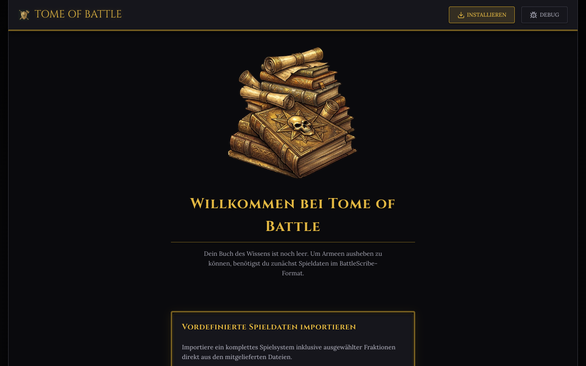
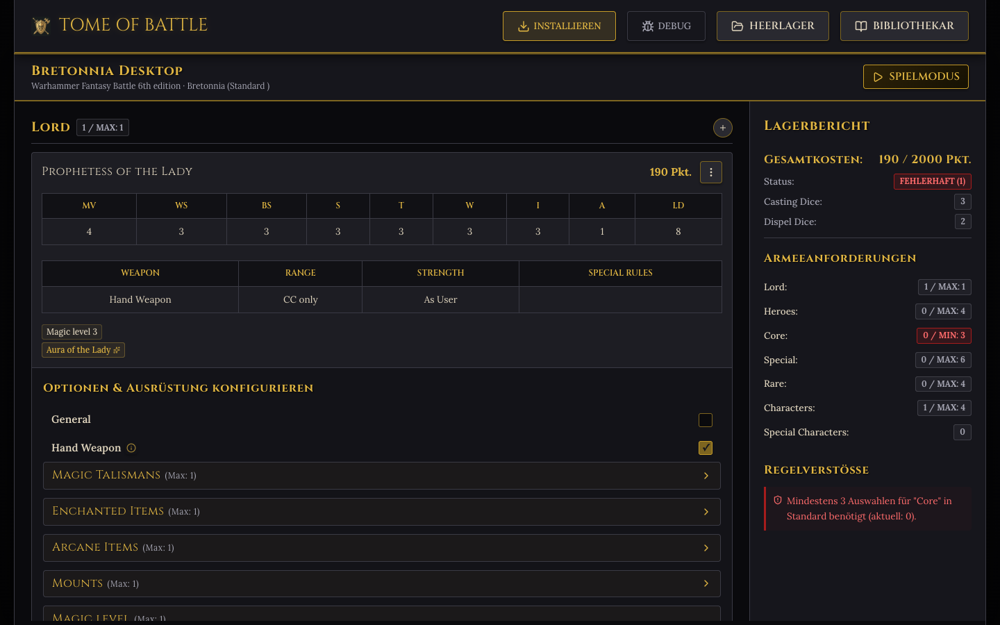
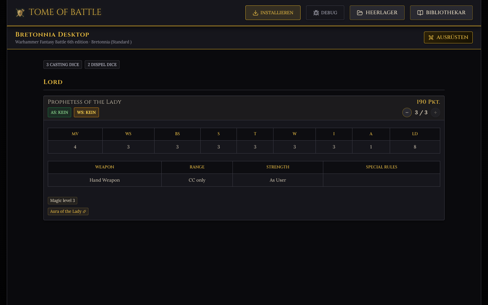
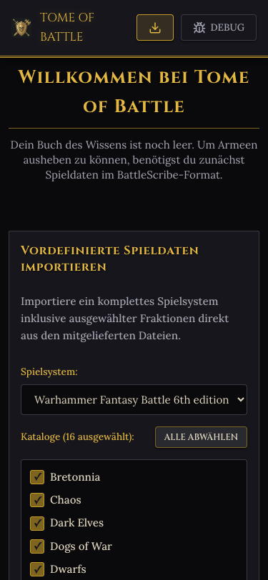
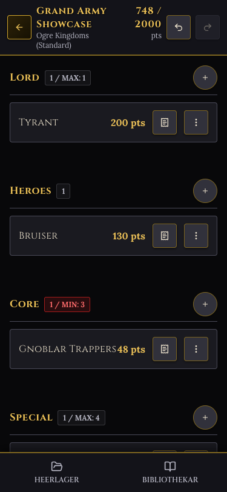
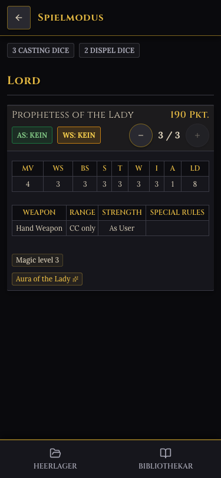

# Tome of Battle — Army Builder

A Progressive Web App (PWA) built with React + Vite for creating and managing army lists for tabletop games based on **BattleScribe** data files (`.cat` / `.gst` XML).

The application runs entirely in the browser — there is no backend. Imported game systems and your army lists are stored locally in **IndexedDB**. This allows the app to work fully offline and be installed onto your device's home screen just like a native application.

---

## Features

- **Import BattleScribe Data** — Simply upload a `.bsz` or ZIP archive of your catalogs. The app parses the raw `.cat` and `.gst` XML files into a queryable game system.
- **Build Army Lists** — Add units, select upgrades and options, and track point costs in real-time.
- **Real-Time Validation** — A dedicated rules engine ("the solver") checks point limits, category limits, and constraints on individual entries and groups as you build.
- **Play Mode** — An additional, temporary view for tracking game rounds, victory points, command points (CP), and remaining wounds of individual models during a game.
- **Offline-First PWA** — Installable, works completely offline, and updates reliably in the background using a service worker.
- **Local & Secure** — All data remains in your browser's IndexedDB. No data is uploaded to any server.

The repository includes a real data package for **Warhammer Fantasy Battle 6th Edition** (`public/catalogs/whfb6/`), which serves as a sample import and for end-to-end testing.

---

## Screenshots

### Desktop View
| Bibliothekar (Library) | Roster Editor | Play Mode |
|:---:|:---:|:---:|
|  |  |  |

### Mobile View
| Bibliothekar (Library) | Roster Editor | Play Mode |
|:---:|:---:|:---:|
|  |  |  |

---

## Getting Started

Requires a recent version of Node.js (including `npm`).

```bash
# 1. Install dependencies
npm install

# 2. Start the Vite dev server
npm run dev
```

Open the local URL printed in your terminal and import a game system to begin. You can use the bundled WHFB 6e catalogs (simply zip the files in `public/catalogs/whfb6/`) or import any other BattleScribe data package.

---

## Scripts

The following NPM scripts are available in the project:

```bash
npm run dev        # Starts the Vite dev server with Hot Module Replacement (HMR)
npm run build      # Creates the production build (also generates a fresh service worker cache version)
npm run preview    # Local preview of the production build
npm run lint       # Code analysis using oxlint
npm test           # Runs unit & component tests (Vitest) and the Puppeteer E2E smoke test
```

### Running Specific Tests

```bash
npx vitest run <path>          # Runs a single test file
npx vitest run -t "<name>"     # Runs tests matching a specific name
```

The Puppeteer end-to-end test (`src/solver/ui.test.js`) is run separately via `npm test`. It packs the WHFB 6e catalog files into a ZIP archive, starts a Vite server, and simulates the entire flow from import to list building and play mode in a headless browser.

---

## Architecture

The data flow is structured as follows: **BattleScribe XML → IndexedDB → In-Memory Roster State**

1. **Import** (`src/parser/`) — `zipExtractor.js` extracts the `.bsz` ZIP archive, then each catalogue (`.cat`) and game-system (`.gst`) file is checked against the vendored BattleScribe XSD (`schemaValidator.js`, wired via `importSchemaGate.js`). This check is **advisory** (ADR 0016): a schema mismatch is logged to the console (`console.warn`, with the offending file and line) but never blocks the import and is not shown in the UI. Roster (`.ros`/`.rosz`) import (`handleImportRoster`) is a separate path and is **not** schema-validated. `xmlParser.js` then reads the catalog XML and translates it into a structured game system object (catalogs, categories, profiles, rules, constraints, modifiers, etc.).
2. **Database** (`src/db/database.js`) — A Promise-based wrapper for IndexedDB with three object stores: `systems` (game systems), `rosters` (army lists), and `settings` (app-wide preferences, e.g. the whfb6 rule-linking toggle). This is the only place that accesses IndexedDB directly. `migrations.js` updates older data structures upon loading.
3. **Roster State** (`src/hooks/useRoster.js`) — The central state manager for the roster currently being edited. It builds an immutable selection tree (`Selection`), debounces saves to IndexedDB (150ms), and recalculates costs and validations on every change.
4. **Play State** (`src/hooks/usePlayState.js`) — Manages the transient state for the play mode.

### The Solver (`src/solver/`)

The rules engine handles all calculations and dependencies, working completely independently of React:

- `catalogResolver.js` — Resolves entry links (`EntryLinks`) and selections against the game system.
- `modifierEvaluator.js` — Evaluates BattleScribe conditions and modifiers.
- `optionsCollector.js` — Collects available profiles, rules, and options for a unit.
- `rosterCounter.js` — Calculates unit counts, category limits, and point costs.
- `rosterValidator.js` — Validates the entire roster against all XML constraints.
- `profileCollector.js` — Determines the effective profile values and rules of a unit, taking modifiers into account.
- `validator.js` — Serves as a central facade to access all solver functions.

### User Interface (`src/`)

`App.jsx` controls the different views (`rosters`, `importer`, `builder`, `play`) as a single-page view switcher without an external router.
- The builder/editor UI is located in `src/components/editor/`.
- The play mode UI is located in `src/components/play/`.
- Styling is based on global CSS classes and semantic typography classes in `src/index.css`.
- The design is responsive above a breakpoint of **900px**. Detailed tooltips are displayed via hover on desktop and via a `BottomSheet` modal on mobile devices.
- Fonts: *Cinzel* and *Lora* are used for a matching gothic/fantasy aesthetic.

---

## Data Model

A `Roster` consists of multiple forces (`Force[]`), which in turn contain a recursive tree of selections (`Selection[]`). A `Selection` references its definition in the catalog via IDs (`entryLinkId` or `selectionEntryId`) instead of duplicating it. Definitions are resolved dynamically at runtime. The type definitions are documented using JSDoc in `src/types.js`.

For more in-depth details on the BattleScribe format, see [`docs/battlescribe-data-format.md`](docs/battlescribe-data-format.md). Contributor guidelines are available in [`CLAUDE.md`](CLAUDE.md).

---

## Tech Stack

React 19 · Vite · IndexedDB · JSZip · lucide-react · Vitest · Puppeteer · oxlint

---

## License

Licensed under the **GNU General Public License v3.0**. See [`LICENSE`](LICENSE).

The BattleScribe catalog data included under `public/catalogs/` belongs to its respective community authors and is used here for testing and demonstration purposes.
