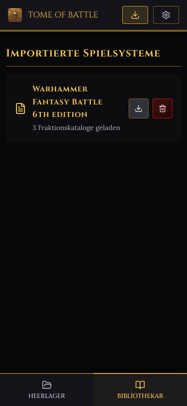
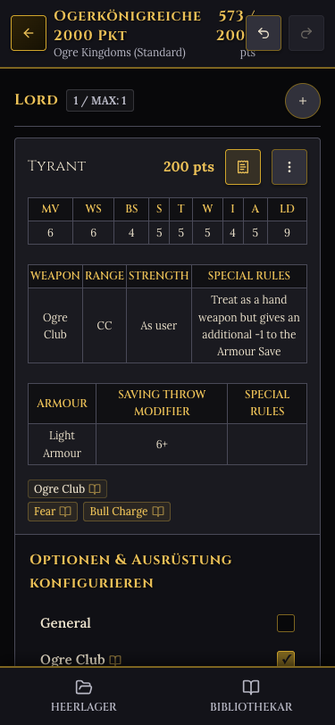
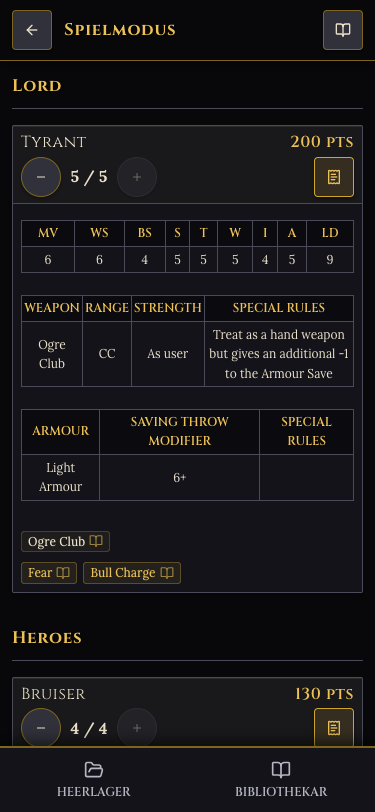

# Tome of Battle — Army Builder

A Progressive Web App (React + Vite) for building and playing tabletop army lists
from **BattleScribe** data files (`.cat` / `.gst` XML).

It runs entirely in the browser — no backend. Game systems and army lists live in
**IndexedDB**, so the app works fully offline and installs onto your home screen
like a native app.

**[Open the app](https://tome-of-battle.vercel.app)** · [Landing page](https://artkoenig.github.io/army_builder/)

---

## Screenshots

| Import a game system | Configure a unit | Play mode |
|:---:|:---:|:---:|
|  |  |  |

---

## Features

- **Import BattleScribe data** — pick a game system and its catalogues from the
  online catalog repository, or upload your own `.bsz` / ZIP archive. Rosters
  (`.ros` / `.rosz`) can be imported too.
- **Build army lists** — add units, pick upgrades and options, watch point costs
  update as you go.
- **Real-time validation** — a clean-room rules engine (`src/domain/evaluator/`) checks
  point limits, category limits and entry constraints on every change.
- **Play mode** — track rounds, victory points, command points and wounds during
  a game.
- **Offline-first PWA** — installable, works offline, updates in the background
  via a service worker.
- **Local only** — nothing is uploaded; all data stays in your browser.

Catalog data is fetched at runtime and is not bundled with the app. A frozen
subset lives in `src/shared/__fixtures__/whfb6/` and is used only by the tests.

---

## Getting Started

Requires Node.js 24 (see `.nvmrc`).

```bash
npm install
npm run dev
```

Open the URL printed in the terminal and import a game system to begin.

## Scripts

```bash
npm run dev        # dev server with HMR
npm run build      # production build (injects a fresh service worker cache version)
npm run preview    # preview the production build
npm run lint       # oxlint
npm run typecheck  # tsc --noEmit over the JSDoc types
npm run analyze    # knip (dead code) + dependency-cruiser (layering, cycles)
npm test           # Vitest unit/component tests + the Puppeteer E2E test
```

`npx vitest run <path>` runs a single test file. The E2E test (`e2e/ui.test.js`)
covers import → list building → play mode in a headless browser, completely
offline against the frozen fixture. `node scripts/generate_screenshots.js` writes
screenshots of every main view to `.screenshots/`.

---

## Architecture

Data flows **BattleScribe XML → IndexedDB → in-memory roster state**:

- `src/data/parser/` — extracts the ZIP archive and translates the catalog XML into a
  structured game system.
- `src/data/db/` — the only place that touches IndexedDB (`systems`, `rosters`,
  `settings`), including migrations of older data.
- `src/domain/roster/` — the write model: creates, resolves and rewrites selection trees,
  independent of React. Structural only; it does not judge a roster.
- `src/domain/evaluator/` — the rules engine, hard-isolated from the write model and
  reached only through its facade `evaluate({ gameSystem, catalogues }, roster) → report`.
  Pure function with its own parser, data model and report.
- `src/domain/evaluation/` — the bridge that feeds the report into the UI.
- `src/ui/components/`, `App.jsx` — the views (`rosters`, `importer`, `builder`,
  `play`), switched without a router; responsive above a 900px breakpoint.

A `Roster` holds forces, which hold a recursive tree of selections. A selection
references its catalog definition by ID instead of copying it; definitions are
resolved at runtime. Types are documented as JSDoc in `src/shared/types.js`.

Further reading: [`docs/project-map.md`](docs/project-map.md) (where everything
lives), [`docs/adr/`](docs/adr/) (architecture decisions),
[`docs/battlescribe-data-format.md`](docs/battlescribe-data-format.md) (the data
format), [`CLAUDE.md`](CLAUDE.md) (contributor guidelines).

---

## Tech Stack

React 19 · Vite · IndexedDB · JSZip · lucide-react · Vitest · Puppeteer · oxlint ·
Knip · dependency-cruiser · TypeScript (JSDoc type checking)

---

## License

**GNU General Public License v3.0** — see [`LICENSE`](LICENSE).

BattleScribe catalog data fetched at runtime, and the frozen test fixture under
`src/shared/__fixtures__/`, belong to their respective community authors and are used
here for testing and demonstration.
