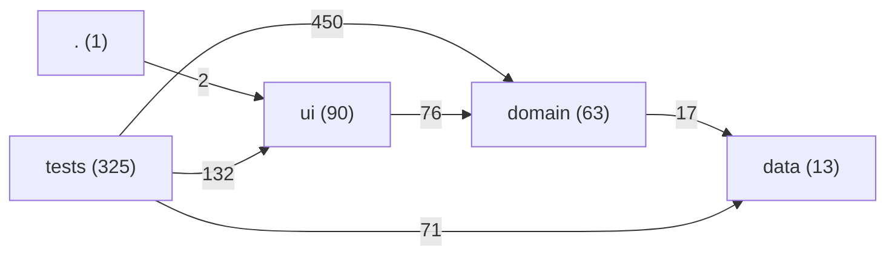
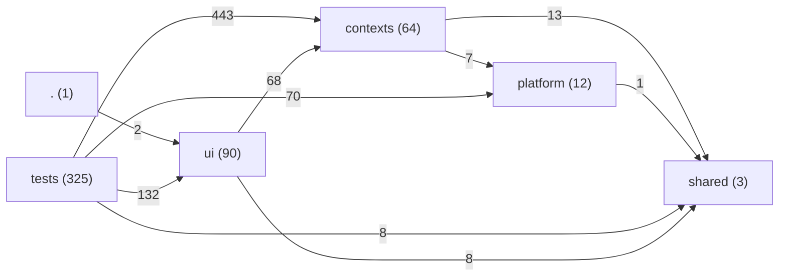

# DDD assessment and refactoring plan

- **Status:** Proposal, not an accepted ADR
- **Date:** 2026-08-25
- **Scope:** `src/` only. Numbers come from `cast report/edges/check --root src` and
  `cast plan simulate`; every claim below names the file it rests on.

## 1. What is already right

The project does not have the usual problems. Measured, not assumed:

- **No dependency cycles.** `cast report --root src`: 492 modules, 2021 edges, `cycles 0`.
- **No layer violation.** `cast check` runs 17 rules, all `severity: error`, and finds
  `0 violations in 1234 module edges`. `ui -> data` is 0. `data -> domain` is 0.
  `domain -> ui` is 0.
- **The rule engine is a real published language.** The whole non-evaluator tree reaches
  `src/domain/evaluator/` through exactly one edge:
  `src/domain/evaluation/evaluationCache.js:37 -> domain/evaluator/evaluator.js`. In DDD terms
  the evaluator is a closed bounded context whose report is its published language
  (ADR 0034), and the boundary is machine-enforced, not merely documented (ADR 0030, 0041).
- **A textbook anti-corruption layer exists.** `src/domain/evaluation/rosterAdapter.js`
  translates the app's write model into the evaluator's input contract and owns the
  mapping rules explicitly. That is exactly what DDD calls an ACL, and it is the reason
  the two models could evolve apart without either corrupting the other.
- **One aggregate, one record.** A roster is stored as a single IndexedDB document
  (`src/data/db/database.js`), so the transactional boundary and the aggregate boundary
  coincide. Most projects get this wrong; this one does not.

The weaknesses below are therefore not "the architecture is broken". They are the
difference between a **clean technical layering** and a **fachlicher (domain) cut**.

## 2. The seven findings

### F1 — The domain model is anaemic; the behaviour lives in React

`src/domain/types.js:8-39` defines `Selection`, `Force` and `Roster` as JSDoc typedefs over
plain objects — data contracts with no behaviour. The behaviour that belongs to them sits in
`src/ui/viewmodels/rosterCommands.js:49` (`createRosterCommands`), which raises units, changes
option counts and rewrites the selection tree by hand:

```js
setRoster(prev => {
  const targetForce = findTargetForce(prev.forces, targetForceId);
  ...
});
```

This is a transaction script over a data structure, placed in the presentation layer. The
consequence is not aesthetic: the UI has to know the shape of the tree, so 31 UI files import
from `domain/roster` and pull tree helpers (`childSelectionsOf`, `countSelections`,
`mapSelectionTree`) straight into view code — e.g.
`src/ui/viewmodels/editor/useCategorySection.js:3`, `src/ui/viewmodels/editor/optionRowDerivations.js:1`.
The aggregate has no encapsulation; every caller navigates its interior.

### F2 — A business invariant is enforced by a React effect

`src/ui/viewmodels/useMandatoryListRuleAutoAdd.js` implements the rule "an unambiguous
mandatory list rule is added automatically" as a `useEffect`. The rule is correct and well
documented — but it holds *only while that component is mounted*. A roster reached by any
other path (a `.ros` import, a migration, a script, a future non-React caller) silently
skips it. In DDD terms the aggregate does not protect its own invariant; the framework does.

### F3 — `domain/services` is an application layer welded to the infrastructure

All 17 `domain -> data` edges that are not the generated schema module come from
`src/domain/services/**`:

- `src/domain/services/rosterStore.js:1 -> data/db/database.js`
- `src/domain/services/settings.js:1 -> data/db/database.js`
- `src/domain/services/systemLibrary.js:1-9 -> data/db/{database,systemImport,catalogSourceIndex,catalogUpdate}.js`, `data/parser/{zipExtractor,libraryDependencies}.js`
- `src/domain/services/catalogRevisions.js:1,7 -> data/db/{catalogUpdate,migrations}.js`

and `src/domain/services/rosterTransfer.js:1` imports `JSZip` directly. These modules are
written as facades (the contract in `rosterStore.js:5-20` is exemplary), but a facade is not
a port: the dependency still points from the domain to Dexie and to a zip library. Swapping
the store, testing without a fake IndexedDB, or running the domain outside the browser all
require touching domain code.

### F4 — `domain/evaluation` is a bounded context without a door

The evaluator has one entry point and 122 test files pinned behind it. The package that sits
in front of it has none: 25 view-model edges reach directly into
`src/domain/evaluation/**` internals — `slotIndex`, `costDisplays`, `violationStats`,
`mandatoryListRules`, `evaluationCache`, `rosterReport` — from `useCategorySection.js:4,5,7`,
`useForceSection.js:4,6`, `useRosterSidebar.js:3,5,6`, `usePlayUnit.js:6,7` and eleven more.
The discipline that was enforced for `evaluator/` was never extended to the package that
translates and projects its output, so the read model's internals are public API by accident.

### F5 — Play mode is a bounded context that exists only as a hook

`Roster.gameState` (`src/domain/types.js:39`) carries the state of an actual game — wounds per
selection — inside the army-list aggregate, and the only code that understands it is
`src/ui/viewmodels/usePlayState.js:18,55`. Two genuinely different subject areas ("what may I
field?" and "what happened in this game?") share one aggregate, one persistence record and one
undo history, and one of them has no domain module at all. This is the clearest missing
bounded context in the project.

### F6 — The foreign format leaks all the way into the components

`src/ui/components/editor/ForceEditorSection.jsx:45-54` maps over `categoryLinks` and keys on
`categoryLink.targetId`. `categoryLink` is BattleScribe XML vocabulary, not this application's
language. Seven view-model files and two components read raw catalogue vocabulary
(`selectionEntries`, `entryLinks`, `targetId`). The ACL of F1's counterpart exists for the
evaluator (`rosterAdapter.js`) but not for the editor, so the catalogue schema is a de-facto
part of the UI contract.

### F7 — The ubiquitous language is spoken in two languages

`Kontingent` appears 364 times in prose, `Force` 320 times in code; `Angebot` 124 times against
`Slot` 355. The project *has* a rich domain language — raising a unit, an offer, an occupied
slot, a contingent — but it exists only in the German comments, while the identifiers carry the
BattleScribe term. Every reader translates twice, and a term can drift on one side without the
other noticing.

## 3. The proposed target: bounded contexts and ports

The cut is by subject, not by technology. Five contexts, two shared kernels, one adapter layer:

```
src/
  contexts/
    armylist/        Core    - building a list
      model/           the aggregate and its behaviour   <- domain/roster/**
      application/     use cases                         <- services/{rosterStore,settings,rosterTransfer}
      ports/           storagePort.js - the only door to the platform
    ruleengine/      Core    - judging a list
      evaluator.js     the published facade (unchanged)  <- domain/evaluator/evaluator.js
      engine/          26 internals, sealed              <- domain/evaluator/**
      acl/             the translator                    <- evaluation/{rosterAdapter,evaluationCache}
      readmodel/       projections + one facade index.js <- the rest of domain/evaluation/**
    catalog/         Supporting - managing catalogues
      application/                                       <- services/{systemLibrary,catalogRevisions}
      ports/           catalogRepository.js
    rulebook/        Generic - rule texts                <- domain/rules/**
  shared/
    battlescribe/    Shared kernel: the foreign format   <- data/parser/schema/*.generated.js
    rostermodel/     Shared kernel: our own vocabulary   <- domain/types.js
    events/                                              <- services/dataEvents.js
  platform/          Adapters, no domain knowledge
    persistence/                                         <- data/db/**
    battlescribe/                                        <- data/parser/** (minus schema/)
  ui/                unchanged in place, but only calls context facades
```

### Today (`cast render --mermaid --root src`)



### After the plan (`--plan ddd-3-contexts-ports`)



The seven `contexts -> platform` edges are the point: today 17 domain modules reach the
database directly, afterwards exactly two port modules do, and rule N2 below keeps it that way.
`shared` has fan-out **0** — a genuine stable kernel that depends on nothing.

### The three stages, as simulated

All numbers from `cast plan simulate .cast/plans/<stage>.json --root src` (the path, not the
bare name: with `--root src` cast looks for `src/.cast/plans/`, and the plans live at the repo
root next to `rules.json`). The three plan files are checked in under `.cast/plans/`.

| Stage | Ops | Cycles | What moves | Verdict |
|---|---|---|---|---|
| 1 — shared kernel | 2 | 0 -> 0 | schema + `types.js` out of `domain`; `domain -> data` 17 -> 10 | simulated clean, **not accepted standalone** |
| 2 — read-model facade | 39 (cumulative) | 0 -> 0 | `domain/evaluation` -> `ruleengine/{acl,readmodel}`, 9 entry points become 1; `domain` fan-in 526 -> 419 | simulated clean, **not accepted standalone** |
| 3 — contexts + ports | 107 (cumulative) | 0 -> 0 | the rest; `domain` and `data` dissolve | **accepted**, exit 0 |

Stages 1 and 2 fail the simulator's instability criterion, and it is worth understanding why,
because it is not a defect: instability is `I = fan-out / (fan-in + fan-out)`, and a shrinking
layer loses its dependents before it loses its own dependencies, so `domain` rises from
0.03 to 0.05 on the way. At stage 3 it reaches 0.00 because the layer is gone. Both stages are
still shippable — they add no edge, no cycle and no violation — but the metric only settles at
the end. Anyone who wants a single accepted delivery has to ship 1+2+3 in one cut.

Final layer figures: modules 492 -> 495, edges 1172 -> 1172, cycles 0 -> 0.
`contexts` fan-in 511 / fan-out 20 (I 0.04), `platform` fan-in 77 / fan-out 1 (I 0.01),
`shared` fan-in 30 / fan-out 0 (I 0.00), `ui` unchanged at I 0.36.

### Two corrections to the first draft, found by the simulation

1. **`domain/types.js` does not belong in `shared/battlescribe/`.** It defines
   `Selection`/`Force`/`Roster` — our *own* list vocabulary (`entryLinkId`, `collective`), not
   the foreign format. Putting it there would invert the translation direction the ACL exists
   for. It becomes a second shared kernel, `shared/rostermodel/`.
2. **`dataEvents.js` cannot live in `armylist`.** It is imported by `rosterStore`, `settings`
   *and* `systemLibrary`; placed in `armylist` it immediately creates
   `contexts/catalog -> contexts/armylist` and breaks rule N1. It becomes `shared/events/`.

One rule that cannot be turned on yet: `armylist/model/** -> armylist/application/**`.
`domain/roster/rosterSerialization.js:1` imports `RosterFileError` from
`services/rosterTransfer.js`. Moving that error class into the model is a one-liner, but it is
outside this plan.

### The rule set has to move with the code

All 17 rules in `.cast/rules.json` are `severity: error` and written against today's paths.
After the move every one of their globs would match nothing, and the gate would go green while
guarding nothing. The rewrite belongs in the same commit as the move.

`.cast/layers.json` first, since six rules address layer names rather than paths:
`fachlogik` -> `kontexte` (`src/contexts/**`), `daten` -> `plattform` (`src/platform/**`),
new `shared` (`src/shared/**`), `evaluator-fassade` ->
`src/contexts/ruleengine/evaluator.js`, `evaluator-intern` ->
`src/contexts/ruleengine/engine/**`. The `anzeige-ableitungen` layer is replaced by
`readmodel-fassade` / `readmodel-intern` / `acl`.

Then the rules. Unchanged in intent, rewritten in glob: #1 `platform -> ui` (widened from
components to the whole UI), #2 `components -> readmodel-intern`, #3 unchanged,
#4 `components -> contexts/ruleengine/**`, #6/#7 `-> plattform`, #8/#9 `plattform ->`,
#10/#11 `contexts ->`, #12 `plattform -> i18n`, #13/#14 between `ruleengine` and `armylist`,
#16 with an explicit `allowed` for `acl -> shared/rostermodel/**` (the ACL is *supposed* to
know both vocabularies), #17 unchanged. Two rules become redundant and should be deleted:
#5 (subsumed by #4) and #15 (subsumed by #14).

Six new rules keep the domain cut honest — each verified against the simulated graph:

| # | Rule | from -> to | Checked |
|---|---|---|---|
| N1 | kontext-kein-fremder-kontext | 12 pairs `contexts/<A>/** -> contexts/<B>/**` | 0 edges between contexts after the move |
| N2 | kontext-nicht-auf-plattform | `contexts/** -> plattform`, allowed `contexts/*/ports/**` | exactly 7 edges, all from the two port modules |
| N3 | plattform-kein-rueckgriff | `plattform -> contexts/**` | platform fan-out 1, target is `shared` |
| N4 | shared-haengt-an-nichts | `shared/** -> contexts/**`, `-> plattform`, `-> ui` | shared fan-out 0 |
| N5 | readmodel-nur-ueber-fassade | `** -> readmodel-intern`, allowed within `ruleengine` | only `readmodel/index.js` from outside |
| N6 | nur-die-acl-ruft-die-engine | `readmodel/** -> evaluator-fassade` | 1 edge today, from the ACL, already correct |

N1 is the rule the project does not have today and the one that makes the whole exercise
enforceable: it is what turns "five contexts" from a diagram into a gate.

## 4. Why this is better than today — in plain terms

The current design answers the question *"which technology is this?"* — UI, logic, data.
The proposed one answers *"which subject is this about?"* — building a list, judging a list,
managing catalogues, playing a game, looking up rules. Five concrete consequences:

**1. A rule can only be changed in one place.**
Today, "a mandatory list rule is added automatically" lives in a React effect
(`useMandatoryListRuleAutoAdd.js`), "a unit is raised into a contingent" lives in
`rosterCommands.js` in the UI folder, and the data they operate on lives in
`domain/roster/`. To change one rule you touch three layers. Afterwards each rule sits in the
context it belongs to, and the UI calls it by name.

**2. The rules hold even where React does not run.**
An invariant enforced by `useEffect` holds only while a component is mounted. The same rule
inside the aggregate holds for a `.ros` import, a migration, a script and any future caller.
That is the difference between a rule and a habit.

**3. Tests get cheaper, not more numerous.**
Testing "raising a unit adds its mandatory members" currently needs a rendered React hook.
As a use case it is a function call: input roster, output roster. The 122 evaluator tests
already show how well this works when the boundary is real — that is why the evaluator is the
part of this codebase nobody is afraid to change.

**4. The database becomes replaceable.**
Today `domain/services` imports Dexie and JSZip directly. With a port, the domain declares
*what* it needs ("load this roster", "save this roster") and the platform layer decides *how*.
Swapping IndexedDB, adding a sync backend, or running the domain in Node for a test needs no
domain change. For a client-only PWA that may sound theoretical — until the first sync feature
or the first server-rendered export is requested.

**5. New people (and agents) find their way by the subject, not by the file type.**
"Where is play mode?" has no answer today: partly in `types.js`, partly in a hook, partly in
components. Afterwards it has one directory. The same is true for every agent run in this
repo — the area notes in `.claude/rules/areas/` would map 1:1 onto contexts instead of onto
folders that mix subjects.

### What it costs, honestly

- The move touches import paths in **~370 test files** (122 evaluator, 55 view-model,
  75 component, 35 roster, 19 evaluation). Mechanical, but broad; every stage must land on
  green `forge-test` before the next one starts.
- All 17 cast rules are written against today's paths and must be rewritten in the same
  commit as the move, or the gate silently stops guarding anything.
- Stage 3 is the only one that changes the *shape* of the tree. Stages 1 and 2 are worth
  doing even if stage 3 is never approved.

## 5. What the move does not fix

Stages 1-3 are a structural refactoring: they move modules and redirect imports. That closes
F3 (the port) and F4 (the read-model facade) completely. It does **not** close F1, F2, F5, F6
or F7 — those are model changes, and no `cast plan` can simulate them. They belong in their own
issues, in this order:

- **Stage 4 — the aggregate gets its behaviour (closes F1).** Move `createRosterCommands` from
  `src/ui/viewmodels/rosterCommands.js` into `contexts/armylist/application/` as named use
  cases (`raiseUnit`, `removeUnit`, `changeOptionCount`, ...). The UI keeps its hooks, but they
  become thin: call the use case, hold the result. Measurable acceptance: no module under
  `src/ui/**` imports a tree helper (`mapSelectionTree`, `replaceSelectionById`,
  `childSelectionsOf`) any more — expressible as a cast rule, so the gate holds it.
- **Stage 5 — the invariant moves into the model (closes F2).** `useMandatoryListRuleAutoAdd`
  becomes a function on the roster use case that every write path runs through, including
  `.ros` import and migration. The hook shrinks to a call. Acceptance: the rule can be tested
  without rendering a component.
- **Stage 6 — play mode becomes a context (closes F5).** `gameState` leaves the roster
  aggregate and gets `contexts/play/` plus its own store record. Two aggregates, two lifetimes,
  two undo histories. This is the largest of the follow-ups and the one with a visible user
  effect, so it needs a version bump and its own PRD.
- **Stage 7 — an ACL for the editor (closes F6).** `categoryLink.targetId` and friends stop at
  a translation boundary the way they already do for the evaluator. A cast rule
  `ui/** -> shared/battlescribe/**` = forbidden makes it permanent.
- **Stage 8 — one glossary (closes F7).** Decide per term whether `Force` or `Kontingent` is
  the name, write it into `docs/` once, and rename in code. Cheap, mechanical, and it removes
  the double translation every reader currently performs.

## 6. Recommendation

Ship stages 1-3 as one cut, with the rule rewrite in the same commit — that is the part the
simulation accepted and the part that pays for itself immediately (`shared` fan-out 0,
`contexts -> platform` narrowed from 17 modules to 2 ports, 25 read-model entry points reduced
to 1). Stages 4-8 are separate issues; 4 and 5 give the most value per line changed, 6 is the
one to plan properly rather than to squeeze in.

Do not start any of it by hand: the plan files are here so `/forge:issue` can turn each stage
into an issue with acceptance criteria, and `/forge:work` can run it.
