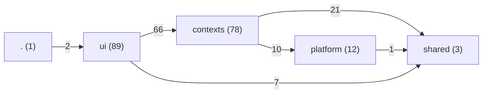

# DDD architecture review — second pass, August 2026

The first pass (`ddd-assessment-and-refactoring-plan.md`, August 2026) found seven defects and
filed eight issues for them (0186-0192). All of them have landed: `src/` is cut into five bounded
contexts, the platform is reachable only through three ports, both ACLs exist, the write use cases
are plain functions, the §9.9 invariant left its React effect, play mode is its own context, and
`docs/glossary.md` decides one name per term.

This is the review of what that left. It measures the code as it stands, not the plan that shaped
it. Everything below names its evidence as `path:line`; the numbers come from `cast report --root
src` and from counting, and say which.

## 0. Status — verified, and partly wrong

Every finding below was afterwards re-checked against the code, one reviewer per finding, and each
is now filed. **The verification disproved or corrected a claim in all nine of them**, so the text
in §2 must not be read as confirmed until issue 0202 rewrites it in place. The corrections are the
most useful part of this table:

| Finding | Issue | What the verification changed |
|---|---|---|
| T4 | [0193](issues/0193-roster-deletion-becomes-a-domain-event-in-the-play-context.md) | There is **no second deletion path**, so the orphaned-record consequence is unreachable; this is placement and testability, not a bug. `emitDataChange` is synchronous and swallows no async rejection — the listener must catch its own. Four area notes state the subscriber rule, not two. |
| T5 | [0194](issues/0194-react-leaves-the-rule-engine-read-model.md) | The read model **is** usable outside React today, and the proposed measure would have made the complaint true. `kontexte -> react` is **not expressible in cast**. Both hooks are redundant — delete one, make the other a pure WeakMap cache; nothing moves. |
| T1, T6 | [0195](issues/0195-one-cost-type-rule-and-a-budget-value-in-the-shared-kernel.md) | The two twins **already disagree on shipped fixture data** (a `library="false"` catalogue declares its own cost type). Eleven modules, not six, and a third answer: seven read the raw field with no fallback. Three T6 citations were wrong. |
| S1 | [0196](issues/0196-context-map.md) | `ui` is **not a bounded context** but a layer and the composition root — which makes "every relationship is realized in a viewmodel" the map's central statement. Seven table rows corrected, three missing. |
| S2 | [0197](issues/0197-domain-vision-statement-and-the-core-domain.md) | 38.4 %, not 39 %, on a JS/JSX-only basis. The first assessment already labels **two** contexts `Core`. The workspace extraction dies on ADR-0031's shared enum module, not on general cost. |
| T2, T3 | [0198](issues/0198-raise-plan-port-for-the-write-use-cases.md) | The port surface is five methods, three fields and a pass-through — three members, not two. The real damage is that a `SlotIndex` rename leaves the suite **green**. Narrow the door to `src/ui/viewmodels/**`, and do not create `src/composition/`. |
| T7 | [0199](issues/0199-roster-invariants-at-the-write-seams.md) | Three of four invariants are not violable; `costLimit >= 0` would reject the legal `-1`. A `throw` in a use case **unmounts the React root** — there is no error boundary. One real defect found: `number="-2"` survives import. |
| Observation A, B | [0202](issues/0202-documentation-corrections-from-the-ddd-review.md) | Both resolve to **no code change**. The `catalogReader.js` split already exists; the documentation describing `rosterSelectionFactory.js` is what is wrong. |
| — (found in passing) | [0200](issues/0200-forge-lint-gates-dependency-cycles.md), [0201](issues/0201-ros-export-omits-catalogue-declared-cost-types.md) | `cast check` gates rules but **never cycles**, so a cycle lands with a green `forge-lint`. And the `.ros` `<costs>` block omits cost types a catalogue declares. |

## 1. Verdict

**The structural half of DDD is done and machine-held. The strategic half was never written down,
and the tactical half stops at the aggregate boundary.**

What the graph says today (`cast report --root src`):

| Measure | Value |
|---|---|
| Dependency cycles | **0** |
| Modules with no layer | **0** |
| `shared` fan-out | **0** (3 leaf modules) |
| `contexts -> platform` | 10 edges, all from the 3 port modules |
| Blocking structure rules | 27 in `.cast/rules.json`, every one `error` |
| Cross-context imports | **1** (`armylist -> ruleengine`, finding T3) |

That is a better layer picture than most codebases of this size ever reach, and it holds because a
gate holds it rather than because everyone remembers. The two anti-corruption layers
(`contexts/armylist/acl/catalogTranslation.js`, `contexts/ruleengine/acl/`) are textbook: the
mapping rules are written out as numbered prose above the code, and a cast rule plus a test
(`src/tests/ui/catalogVocabulary.test.js`) stop the foreign vocabulary from travelling past them.

Where it falls short is where a structure checker cannot look:

- **Nothing says which context is the core domain**, so nothing says where to spend effort. 39 % of
  production code sits in one context and no document defends that.
- **The relationships between the five contexts are undeclared.** DDD's context map exists to say
  *upstream/downstream, conformist, shared kernel, customer/supplier*. Here the five contexts are
  named but their relationships are implicit in a rule file.
- **One domain rule has two implementations in two contexts**, because the "no context imports
  another" rule made duplication the only legal answer and no one noticed it was the wrong one.
- **The write model's dependency on the read model is real but typed as `Object`**, so it is
  invisible to `forge-typecheck` and to cast alike.
- **A cross-aggregate policy lives in a React hook**, for the same reason.

## 2. Findings

Ordered by value per line changed, not by severity.

### T4 — A cross-aggregate policy lives in a React hook

**Evidence.** `src/ui/viewmodels/useRosterList.js:182-185`: `await deleteRoster(id)` followed by
`await endGame(id)`. `.claude/rules/areas/play.md` records it as intended: *"Ein Löschen der Liste
löscht ihre Partie. Weil kein Kontext den anderen ruft, verdrahtet das die Oberfläche."*

**Why it matters.** "When a roster is deleted, its game ends" is a rule of the domain, not of the
screen. Today it holds only on the one path a user takes through the list view. Any other deletion
path — a migration, a future bulk delete, a script — leaves an orphaned `games` record behind, and
the rule is untestable without a renderer. This is the same defect the first pass found as F2 (an
invariant in a `useEffect`) and closed for §9.9; it survived here in a different shape.

**Measure.** The channel for this already exists and already carries the message:
`src/shared/events/dataEvents.js` emits `DATA_EVENT.ROSTER_DELETED` from
`contexts/armylist/application/rosterStore.js:53`. Let `contexts/play/application/` subscribe to it
and call `endGame` itself. Two contexts then integrate through a published event instead of through
the UI, with no import between them — which is what the shared kernel was for. The area note's
"exactly one subscriber" rule (`areas/application.md`, `areas/viewmodels.md`) has to be amended in
the same change: the rule was written to stop *screens* from subscribing, and a context reacting to
a domain event is not that.

**Cost.** Small. One subscription, one deletion from `useRosterList.js`, one area-note edit.

### T5 — Two modules of a bounded context import React

**Evidence.** `src/contexts/ruleengine/readmodel/rosterReport.js:14` and
`src/contexts/ruleengine/readmodel/useEvaluation.js:37` both `import { useMemo } from 'react'`.
They are the only two non-UI modules in `src/` that do (`grep -rn "from 'react'" src/contexts
src/platform src/shared`).

**Why it matters.** Layered Architecture asks the domain layer to carry no dependency on the user
interface. Both modules are memo wrappers over `evaluateAppRoster` — pure caching mechanics
expressed in one framework's vocabulary. The consequence is not theoretical: the read model cannot
be used outside React, so any non-React caller (the `.ros` export path in `useRosterList.js`, a
script, a future worker) has to reach past the door to `evaluationCache.js` and re-implement the
bundling. The identity-stability contract those hooks exist to keep is a React concern and belongs
where React lives.

**Measure.** Move both hooks to `src/ui/viewmodels/`, keep `unresolvedSelectionsOf` and the rest of
the derivations in the context, and re-export nothing React-shaped from
`readmodel/index.js`. Add a cast rule `kontexte -> react = forbidden` so the gate holds it — cast
sees `react` as unresolved today, so the rule has to name the specifier, not a path.

**Cost.** Small. Two files move, `readmodel/index.js` loses two lines, the importers change one
path each.

### T1 — One domain rule, two implementations, two contexts

**Evidence.** The question *"which cost type is this roster measured in?"* is answered twice:

- `src/contexts/armylist/model/costTypeLabels.js:21` — `resolveCostLimitTypeId(roster, system)`,
  falling back to `system.costTypes[0].id`
- `src/contexts/ruleengine/readmodel/costDisplays.js:24` — `costLimitTypeIdOf(roster, costTypes)`,
  falling back to `costTypes[0].id`

The label derivation is duplicated with them (`resolveCostTypeLabel` at `costTypeLabels.js:36`
vs. `costTypeLabelOf` at `costDisplays.js:37` — both trim, both for the same stated reason, both
citing the same catalogue quirk), and so is the roster-label wrapper (`resolveCostLimitLabel:42`
vs. `costLimitLabelOf:50`). Six UI modules pick one of the two by no visible criterion:
`useRaiseOffer.js:43`, `useOptionGroup.js:43` and `useSelectionConfigurator.js:38` take the
`armylist` twin; `usePlayRoster.js:29` and `usePlayUnit.js:149` take the `ruleengine` twin.

**Why it matters.** This is the failure mode Ubiquitous Language exists to prevent, and the
glossary does not catch it: `docs/glossary.md` has a `costLimit` row that names
`resolveCostLimitTypeId` and never mentions its twin. The two differ only in which object they read
the declarations from (`system.costTypes` vs. `description.costTypes`) — a difference of plumbing,
not of meaning. They agree today by coincidence of two independent readings of the same rule; a
change to the fallback in one is invisible from the other.

The root cause is worth naming: `kontext-kein-fremder-kontext` is right, and the answer to shared
knowledge under it is a **shared kernel**, which `src/shared/` already is. Nobody reached for it.

**Measure.** Add `src/shared/costs/costTypes.js` to the shared kernel: `costLimitTypeIdOf(roster,
costTypes)`, `costTypeLabelOf(costTypes, id)`, `costLimitLabelOf(roster, costTypes)` — one
implementation, taking the declarations as an argument so neither reading is privileged. Both
contexts re-export from it; `shared-haengt-an-nichts` still holds (fan-out stays 0). Add a
`costType` row to `docs/glossary.md` naming the survivor and the two rejected synonyms.

**Cost.** Medium. One new shared module, two contexts lose ~40 lines, eight call sites keep their
names via re-export.

### S1 — There is no context map

**Evidence.** `grep -rin "context map|kontextkarte|core domain|kerndomäne|vision" docs/` returns
nothing relevant. ADR-0042 defines the cut and the ports; it does not name a single relationship
between two contexts. `.claude/rules/areas/contexts.md` comes closest, and it is a rule file.

**Why it matters.** The relationships exist and each one carries a real obligation that nobody has
written down:

| From | To | Relationship as built | Where it shows |
|---|---|---|---|
| `ui` | `ruleengine` | **Conformist** — the UI speaks the report's invented vocabulary (`slot`, `capability`, `offer`, `raiseMembers`) unchanged | 8 editor viewmodels import `readmodel/index.js` |
| `armylist` | `ruleengine` | **Customer/Supplier**, undeclared — the write use cases cannot work without `report.slots` | T2, T3 below |
| `play` | `armylist` | **Separate Ways plus a shared kernel** — coupled only by `rosterId` and the shared roster shape | `play/model/game.js:113-134` walks the tree a second time on purpose |
| `platform/battlescribe` | BattleScribe XSD | **Conformist to a Published Language** | ADR-0016, the vendored XSD, the generated enum module |
| `catalog` | the fork repo | **Customer/Supplier across an org boundary** | ADR-0014/0017/0018 |

A reader cannot get this out of `rules.json`, and the obligations differ: a conformist relationship
means the downstream absorbs every upstream rename (and the UI does — the report's vocabulary is in
its hook names); a customer/supplier relationship means the downstream's needs are supposed to
factor into the upstream's planning, which is exactly the conversation T2 is missing.

**Measure.** One page, `docs/context-map.md`, with the table above, a mermaid diagram of the five
contexts and their two outside partners, and one paragraph per relationship saying what it obliges.
Link it from `docs/project-map.md` and the ADR index. No code changes.

**Cost.** Small, documentation only — and it is the prerequisite for arguing about T2 and S2.

### T2 — The read model's vocabulary travels into the write model as `Object`

**Evidence.** `src/contexts/armylist/application/raiseUnit.js:86` — `@param {Object} command.slots
Slot-Seite des Berichts (report.slots)`. The same `Object`-typed `slots` and `system` parameters
appear in 11 JSDoc blocks under `src/contexts/`. `raiseUnit.js:71` then calls
`slots.findChildSlot(slots.pathOfForce(forceId), defId)?.raiseMembers` — three methods and a field
of `SlotIndex`, a `ruleengine` type, invoked from `armylist`. `subSelectionUseCases.js` takes the
same pair. `.claude/rules/areas/roster.md` states the intent plainly: *"`system` and the report's
`slots` are handed in (ADR-0039) and typed as `Object`, so nothing here imports the read model."*

**Why it matters.** ADR-0039 solved the import, not the coupling. The write model depends on a
foreign context's projection to do its work, and it says so in a type that means "anything". Three
things follow. `forge-typecheck` holds nothing at that seam — a renamed method on `SlotIndex`
compiles and fails at runtime. `strictNullChecks` (Issue 0185) buys nothing there either. And the
dependency is invisible to every reader who does not already know: the parameter is called `slots`
and its type is `Object`.

DDD's answer is not to widen the type but to narrow the question. The write model does not need a
`SlotIndex`; it needs two answers — *which members does raising `defId` in this force create?* and
*which mandatory list rules is this force still missing?* Those are `armylist`'s own words.

**Measure.** Declare `armylist`'s inbound port next to its two outbound ones:
`src/contexts/armylist/ports/raisePlanPort.js`, a typedef with `membersFor(forceId, defId)` and
`missingListRulesFor(forceId)` and nothing else. Type the use cases against it. Implement the
adapter over `SlotIndex` once, in the UI layer where both contexts are already legal —
`src/ui/viewmodels/` today, or a small `src/composition/` if the wiring earns a home. The write
model then states its need in its own vocabulary (Intention-Revealing Interface), typecheck holds
the seam, and the dependency is legible.

**Cost.** Large — six use cases and their tests change signature — and it is the one measure here
worth planning as its own issue rather than squeezing in.

### T3 — The one cross-context import is the place the port is missing

**Evidence.** `src/contexts/armylist/application/mandatoryListRules.js:28` imports
`findMissingMandatoryListRules` from `../../ruleengine/readmodel/index.js`. It is the only
`contexts -> contexts` edge in the graph, permitted by the `lesemodell-die-eine-tuer` exception in
`.cast/rules.json`.

**Why it matters.** The exception was written so the *UI* could reach the read model from anywhere.
It happens to also let one context reach another, and exactly one module took the offer. That is
how a global exception erodes: `areas/contexts.md` already warns that a broadly cut `allowed` entry
silently disables neighbouring rules.

**Measure.** Falls out of T2: `missingListRulesFor(forceId)` on the raise-plan port removes this
import. Afterwards, narrow `lesemodell-die-eine-tuer` to `src/ui/**` so the exception cannot be
taken by a context again.

**Cost.** None beyond T2, plus one rule edit.

### S2 — Nothing declares the core domain, and 39 % of the code is in one context

**Evidence.** Production lines by area (`find … | xargs cat | wc -l`, tests excluded):

| Area | Lines | Share |
|---|---|---|
| `contexts/ruleengine/engine` | 10 858 | 39 % |
| `ui` | 9 478 | 34 % |
| `contexts/armylist` | 2 959 | 11 % |
| `platform` | 2 284 | 8 % |
| `contexts/ruleengine/readmodel` + `acl` | 1 340 | 5 % |
| `contexts/play` + `catalog` + `rulebook` + `shared` | 762 | 3 % |

**Why it matters.** Distillation asks which part of the model is the business asset, so that effort
and the best design work go there and everything else is justified by how it supports it. This
project has never answered it, and the number above is the reason to: the engine is a clean-room
reimplementation of another product's rule semantics against a published schema — the classic shape
of a **generic subdomain or a cohesive mechanism**, not of a core domain — and it is by far the
largest thing in the tree. If the engine *is* the core (defensible: correct evaluation is what
makes the app usable at all), the write model at 11 % is undernourished and the ratio is a
deliberate bet. If the list-building and play experience is the core, then two thirds of the code
serves a supporting subdomain and that should be a conscious position, not an accident.

**Measure.** Two steps, in order.

1. **A Domain Vision Statement**, one page, `docs/domain-vision.md`: what this app is for, what the
   user gets that BattleScribe does not give them, and which context is the core. Write it before
   the next feature, revise it as insight arrives. It costs an afternoon and it is what makes every
   later "is this worth it?" answerable.
2. **Then, if step 1 says the engine is a supporting mechanism**: make the boundary physical. The
   engine already has one door (`contexts/ruleengine/evaluator.js`), a two-stage pure interface, its
   own test corpus and an XSD it conforms to — it is a package that happens to live in a folder.
   Moving it to an npm workspace makes the dependency direction unbreakable rather than
   gate-enforced, gives it a version, and shrinks the app tree to the part that is actually this
   project's. Do not do this before step 1: if the engine is the core, it belongs where the core
   belongs.

**Cost.** Step 1 small. Step 2 medium-to-large and gated on step 1.

### T7 — The roster is a document, not an aggregate — the code should say so

**Evidence.** `src/shared/rostermodel/types.js` is 65 lines of JSDoc and `export {}` — the roster,
force and selection have no behaviour and no runtime existence. ADR-0011 and
`.claude/rules/areas/roster.md` make this deliberate: *"`src/contexts/armylist/model/` is
structural only — it never judges a roster."* The consequence shows at the write boundary:
`raiseUnit.js:53` returns the roster unchanged when the named force is unknown, and
`raiseUnit.js:44` documents the contract as *"daran erkennt der Aufrufer an der Identität, dass
nichts geschah"*.

**Judgment.** The split is right, and it is the most interesting decision in this codebase: the
invariants of an army list are not properties of the data, they are declared by a third-party
catalogue and can change under a stored roster (ADR-0018). An aggregate cannot enforce rules it
learns at runtime from a file. So `armylist` holds a **draft document** and `ruleengine` issues a
**compliance statement** about it — a legitimate and well-executed pattern that DDD has no single
name for.

Two things follow, and neither is done:

1. **Name it.** The vision statement (S2) should say this in one paragraph. Today a reader meets an
   `application/` folder full of "use cases" over an anaemic model and reasonably concludes the
   model was never finished, when in fact the emptiness is the design.
2. **Assert the few invariants that *are* the app's own.** A force belongs to its roster; a
   selection id is unique within a roster; `number >= 1`; `costLimit >= 0`. None is catalogue-driven
   and none is checked. `rosterStore.loadRoster` (`rosterStore.js:33`) hands whatever IndexedDB
   holds straight into the model with no reconstitution, and the silent-identity-return contract
   above means a caller that passes a stale `forceId` gets no error and no unit — the exact failure
   Assertions exist to make loud.

**Measure.** A `reconstituteRoster(record)` at the repository seam that asserts the four structural
invariants and throws a `messageKey`-carrying error otherwise, plus a throw (not a silent identity
return) in the use cases where the target does not exist. Keep every catalogue-driven rule out of
it — that stays the report's job.

**Cost.** Medium. One new model module, one seam in `rosterStore`, a handful of use-case tests that
currently assert on "nothing happened" and would assert on a throw.

### T6 — The budget is a domain concept with no home

**Evidence.** `costTotals[roster.costLimitType]` is read in six modules
(`useRosterSidebar.js:60`, `useAutoFillSuggestions.js:66`, `useRosterDashboard.js:41`,
`useRosterEditor.js:96`, plus `costProjection.js` and `rosterSerialization.js` on the writing side).
The subtraction that turns it into "remaining" appears in `useAutoFillSuggestions.js:66` and, in
another shape, in `editor/costBudgets.js`. The pair `costLimit` + `costLimitType` travels as two
separate fields everywhere (`types.js:36-37`).

**Why it matters.** "Wieviel habe ich noch?" is the single most-asked question in the domain, and it
is a concept the model does not have: every screen recomputes it from two roster fields and a map.
The glossary has a `costLimit` row; the code has no `Budget`.

**Measure.** In the shared cost kernel from T1, add a value: `budgetOf(roster, costTotals) ->
{ typeId, limit, spent, remaining, isExceeded }`, immutable and side-effect-free. The four
viewmodels ask for it instead of computing it. This is Closure of Operations territory and cheap
once T1 exists.

**Cost.** Small, and it should ride along with T1 rather than be its own issue.

### Two observations, not obligations

- **The selection factory sits in the application layer.**
  `contexts/armylist/application/rosterSelectionFactory.js` is a domain factory by every DDD
  criterion; it landed in `application/` because it needs `system` and `resolveEntry` injected.
  Factories "may have no responsibility in the domain model but are still part of the domain
  design" — moving it to `model/` with the injection intact would be more honest. Cosmetic; do it
  when the file is open for another reason.
- **The engine has no size discipline.** `evalTree.js` 1 475 lines, `catalogReader.js` 1 299,
  `report.js` 916, `resolver.js` 825 — while `src/ui/viewmodels/**` is held to a hard 300 (Issue
  0176). Not a pattern violation: a Cohesive Mechanism is allowed to be large, and this one is
  pinned by a real E2E corpus. But `catalogReader.js` does two jobs (read, then merge and resolve)
  and is the file where the "what" and the "how" mix most. Worth a soft ceiling and one split when
  it next resists a change; not worth an issue on its own.

## 3. Recommended order

| # | Measure | Finding | Cost | Why here |
|---|---|---|---|---|
| 1 | `play` subscribes to `ROSTER_DELETED` | T4 | S | Highest value per line; removes a domain rule from a hook using a channel that already exists |
| 2 | React out of `contexts/` | T5 | S | Two files, and it makes the read model usable outside React |
| 3 | Cost-type shared kernel + `budgetOf` | T1, T6 | M | Kills a live duplication of one rule and gives the domain its most-used missing concept |
| 4 | `docs/context-map.md` | S1 | S | Documentation only, and it is what the next two arguments need |
| 5 | `docs/domain-vision.md` | S2.1 | S | Answers "where do we spend effort"; gates measure 7 |
| 6 | Raise-plan port + narrow the read-model exception | T2, T3 | L | The real remaining coupling; plan it as its own issue |
| 7 | Roster reconstitution and assertions | T7.2 | M | Makes silent no-ops loud |
| 8 | Engine as a workspace package | S2.2 | L | Only if the vision statement says it is a supporting subdomain |

Measures 1-5 are worth doing in one stretch; each is small and none blocks another. Measure 6 is the
one to plan properly. Measures 7 and 8 are decisions before they are work.

## 4. What deliberately stays

Not every asymmetry here is a defect, and three in particular should survive the next review:

- **The engine speaks BattleScribe's language throughout** (ADR-0031/0032, and `docs/glossary.md`
  puts it out of scope on purpose). It is a conformist to a published language; translating inside
  it would be a second model of the same format.
- **`play` walks the selection tree a second time** (`play/model/game.js:113-134`) rather than
  borrow `armylist`'s helper. That is what a context boundary costs, and the note says so. Sixteen
  duplicated lines are cheaper than the import.
- **German prose with English identifiers.** The glossary decided this per term rather than renaming
  364 comments. It is a judgment about readers, not a lapse — and the glossary is what keeps it from
  becoming one.
