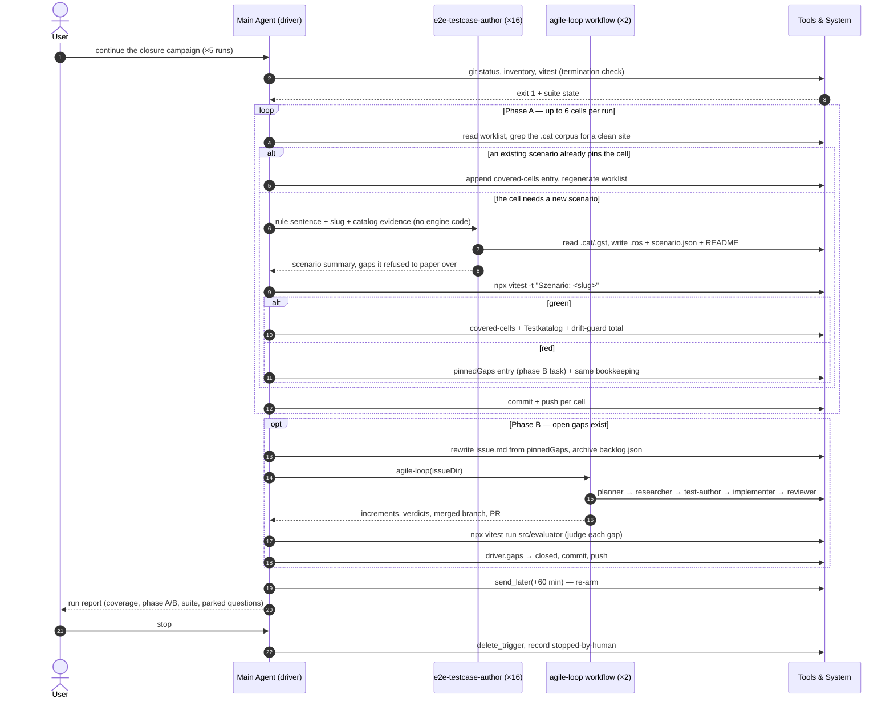

# Evaluator gaps pinned by the coverage campaign

## Goal

Make every scenario listed below green by changing `src/evaluator/` production code. Each entry is a committed black-box E2E scenario whose expectations were derived from the catalog data alone; the scenario is the specification and the engine is what is wrong.

## Context

- The scenarios were authored by the `e2e-testcase-author` subagent under ADR 0033 and are pinned in `docs/testing/campaign-state.json` under `pinnedGaps`.
- `npx vitest run src/evaluator` runs the manifest-driven runner `src/evaluator/e2e.testcatalog.test.js` over them.

## Acceptance criteria

- `docs/testing/at-least-roster-points-limit` — failing cases: `Szenario: at-least-roster-points-limit > rosters/01-limit-2000-gate-open.ros`, `rosters/02-limit-1999-gate-closed.ros` and `rosters/03-limit-1999-spent-2000-gate-closed.ros`. What the catalog data demands: a single selection of "Tournament rules: Uprising (2026)" (`4bc4-8781-2091-d9df`, reached through the group `43b3-35c6-d7cc-e3c6` below the entry `6fcf-b33d-3cf5-b56a`, which carries `hidden="true"`) must be counted. Its occupied slot must report `current` 1 — the report has 0 — and its own limit `00f6-c1b3-ee85-5c02` (`type="max" value="0" field="selections" scope="force"`, raised to 1 by a `set` only while the `and` group of `atLeast 2000` and `atMost 2500` on `limit::ecfa-8486-4f6c-c249` holds) must fire with actual 1 against bound 0 at a `costLimit` of 1999; the report carries no message for that limit at all. Roster 03 additionally demands that `limit::<costTypeId>` reads the roster's **configured** cost limit and not the summed cost of its selections: at `costLimit` 1999 with 2000 points spent, the gate stays closed.

## Out of scope

- Changing, weakening or deleting any scenario under `docs/testing/` — its `.ros` files, its `scenario.json` and its `README.md` are the specification.
- Authoring new E2E scenarios; the coverage campaign's phase A does that.
- Any change outside `src/evaluator/` and its unit tests.

## Decisions

- The check command for this issue is `npx vitest run src/evaluator`.
- No version bump inside the campaign; the human decides that when the campaign branch merges.

## Retro

Session of 2026-08-09/10, runs 4–8 of the unattended evaluator coverage-closure
campaign. Coverage moved 34/105 → 64/105; three engine gaps were pinned and all
three closed; the evaluator suite ended green at 1159 cases.

### Session Metrics Summary

| Metric | Value |
| :--- | :--- |
| Wall clock | 10h 33m (2026-08-09T19:52Z → 2026-08-10T06:25Z) |
| Main-loop tokens | 61,756,358 (output 132,859; cache read 59,735,980 — 96.7 % cache hit) |
| Subagent tokens (16 authors) | 2,733,679 |
| Workflow tokens (2 runs, 31 agents) | 2,169,602 |
| Total | ~66.7 M |
| Main-loop tool calls | 209 (4 failed) — Bash 174, Agent 16, send_later 5, Skill 3, Read 3, Workflow 2, Write 2, Edit 1, MCP 3 |
| Errors | 0 |
| Cells closed | 24 (12 by new scenario, 12 by recording an existing one) |
| New scenarios | 13 |

### Per-Agent Breakdown

| Agent | Steps / Tool calls | Tokens | Duration |
| :--- | :--- | :--- | :--- |
| **main** | 32 steps / 209 (4 failed) | 61,756,358 | 10h 33m |
| author: set-primary-category-membership | 42 | 149,832 | 9m 34s |
| author: unit-scope-instance-of-category | 44 | 167,444 | 12m 02s |
| author: less-than-roster-category-count | 43 | 162,533 | 11m 13s |
| author: greater-than-parent-upgrade-gate | 29 | 130,748 | 6m 42s |
| author: set-cost-value-force-gate | 32 | 135,930 | 7m 59s |
| author: force-id-scope-instance-of | 32 | 137,981 | 7m 22s |
| author: at-least-roster-points-limit | 49 | 177,712 | 9m 14s |
| author: at-least-self-model-count | 31 | 143,739 | 6m 41s |
| author: parent-max-include-child-selections | 63 | 206,766 | 16m 54s |
| author: parent-repeat-item-count | 36 | 131,235 | 9m 38s |
| author: unconditional-modifier-group | 75 | 238,571 | 19m 01s |
| author: nested-modifier-group | 55 | 225,037 | 16m 08s |
| author: parent-repeat-model-include-children | 45 | 191,808 | 11m 01s |
| author: parent-repeat-item-include-children | 38 | 153,933 | 9m 41s |
| author: roster-repeat-category-count | 59 | 230,467 | 15m 54s |
| author: not-instance-of-force-gate | 34 | 149,943 | 8m 02s |
| workflow: agile-loop (run 4, 23 agents) | 695 | 1,710,092 | 2h 07m |
| workflow: agile-loop (run 6, 8 agents) | 190 | 459,510 | 31m 25s |

### Sequence Diagram

### Rulebook & Process Friction

**The drift guard's hardcoded totals were the single biggest friction.**
`scripts/lib/evaluator-coverage-corpus.test.js` asserts
`{ cells: 105, covered: N, uncovered: M }` as literals. Every one of the 24
cells closed this session required a manual `sed` on that line plus a re-run of
that test file — 14 separate edit-and-verify cycles, each ~7 s of test time and
one more file in every commit. The number is a moving campaign statistic living
inside a test that already has a real drift guard one line above it
(`expect(recomputed).toEqual(committed)`), which catches everything the literal
catches and more.

**The stop hook fired against work that was legitimately in flight.** Twice the
git-check hook demanded a commit while author subagents were still writing under
`docs/testing/<slug>/`. Committing there would have captured a half-written
scenario. The hook cannot see that a background agent owns those paths.

**One rule was applied more rigidly than it needed to be.** The explorer skill
says "complete exactly one cell per invocation". I honoured the per-cell
bookkeeping and commits serially, but ran up to three author agents
concurrently — the contract does not actually speak about concurrency, and
reading it strictly the first time cost run 4 roughly 20 minutes of idle
wall-clock before I started overlapping them.

**Where I was too rigid in the other direction:** I read all 1,517 lines of
`docs/battlescribe-data-format.md` at session start because the skill says to,
spending ~45 k tokens, and then delegated every derivation to authors who read
the document themselves. The driver needs §7.6/§7.7/§8 to judge a scenario, not
the workflow and glossary chapters.

### Subagent Efficiency & Delegation

**Delegation paid for itself clearly.** 2.73 M tokens of catalog reconnaissance
and scenario authoring happened outside the main context; what came back was a
summary of 300–600 words each. That is what let one session carry five complete
runs without a context reset.

**But the briefing overhead was real and partly duplicated.** For each new
scenario I first grepped the `.cat` corpus myself — locating a clean, isolable
site, resolving ids, checking that no `<repeat>` was co-extensive with the
condition — typically 3–6 tool calls, sometimes more (the `greaterThan|parent`
cell needed a scan of every modifier in four catalogues to find the two sites
without a `<repeat>`). The author then re-derives every id from scratch, as its
premise requires. That double read is deliberate — it is what keeps the
scenario black-box — but it means the campaign pays for the same lookup twice.
The right split is the one that emerged by run 6: I find *which* site, the
author derives *what it means*.

**Three briefings sent an author at a carrier that did not hold up**, and in
each case the author caught it rather than faking a result: the two Ogre anchors
for the bare-bracket cell were unobservable (the `set-primary` target category
was already carried raw); my "17 nested modifier groups" came from the cell
count, not from 17 nested *sites* (there are three, all with unconditional outer
brackets); and the Power Stone wrapper premise I quoted from §9.7 is true of the
BSData `whfb6` set but not of the Definitive Edition fixture, where the entry is
flat. Each cost a full agent run of exploration. The lesson is not to stop
naming anchors — the anchors saved far more time than they cost — but that an
anchor should be labelled as a starting point, which later prompts did.

**The cheapest cells needed no agent at all.** Half of this session's closures
(12 of 24) were existing green scenarios that had never been recorded in
`covered-cells.json`. Checking "does a scenario already pin this?" before
delegating cost 1–2 tool calls and saved a 10–19 minute agent run each time.
This check should be the first step of every cell, not an optimisation I
happened to try.

### Specification & Planning Quality

**Phase B specifications held.** Both workflow runs finished with
`blockedOnHuman: []` and no question parked. The acceptance criteria were
mechanical to write because the pinned scenario *is* the specification: the
failing case labels, the ids, the demanded `actual`/`bound` all come straight
out of the manifest. Nothing surfaced late during implementation.

**One increment was refused twice, for prose rather than behaviour.** The
`set-primary-membership` increment met all six of its criteria with the suite
green, and was still rejected — first for landing an unasked-for
`src/evaluator/CLAUDE.md`, then for a comment claiming a diagnostics safety net
the wiring did not provide. It was re-cut as `set-primary-anchor-count` with two
extra criteria ("lands no convention document", "every comment states what the
code actually does") and passed with zero findings. Nine recorded steps were
discarded to learn a bar that was implicit in the reviewer and absent from the
issue. Those two criteria belong in the campaign issue template from the start.

**No unauthorised deviations.** Both workflow runs stayed inside
`src/evaluator/`, touched nothing under `docs/testing/`, and the final fixes
were one line each in `infoProjection.js`, the anchor-`current` derivation and
`countingFlagsOf`. Three review observations were recorded rather than acted on,
correctly — they were outside the increments' criteria.

**One deviation of mine, stated openly:** the campaign branch recorded in
`campaign-state.json` (`claude/evaluator-coverage-campaign`) had been merged and
deleted before run 4, so the campaign continued on the session's designated
branch and the state was updated to record that. The skill has no rule for a
merged-and-deleted campaign branch.

### Token & Latency Optimization

**Cache utilisation was excellent and did the heavy lifting**: 59.74 M of the
61.76 M main-loop tokens were cache reads (96.7 %), against 132,859 output
tokens. The long-running single session is what made that possible — a fresh
session per run would have re-paid the whole prefix.

**Latency, not tokens, was the constraint.** The session spent most of its 10.5
hours waiting: 2h 38m in the two workflows, ~3h in author runs, and roughly 10
full-suite runs at 45–80 s each. The single biggest saving was running two or
three authors concurrently — runs 5–8 each closed six cells in about half the
wall-clock run 4 needed for the same count.

**Identifiable waste:**
- Full-suite `vitest` output was dumped raw the first time (~40 lines of pass
  list) before I started piping through `grep`/`sed`; every later run was
  filtered to the 3–5 lines that matter.
- The 45 k-token format-doc read at session start (see above).
- ~14 drift-guard edit/verify cycles, each a `sed` plus a test run, purely to
  move a hardcoded integer.
- Two suite runs were launched while author agents were still active and
  reported 2–3 spurious failures, each costing an investigation run to prove
  they were flakes.

### Tooling & Automation Opportunities

1. **`scripts/evaluator-coverage-record.js <cellKey> <scenarioDir> <rationale>`** —
   append the `covered-cells.json` entry, regenerate `worklist.json`, and update
   the drift-guard total in one call. This exact three-step sequence ran 24
   times this session, by hand, every time.
2. **Stop hardcoding the totals in the drift guard.** Derive them from the
   committed `worklist.json`, or have `evaluator-coverage-inventory.js` rewrite
   the literal when it regenerates the worklist. The real guard
   (`recomputed` deep-equals `committed`) already covers the same ground.
3. **An "is this cell already pinned?" query** — `evaluator-coverage-inventory.js
   --why <cellKey>` listing the manifests and rosters that touch the construct.
   It would have found 12 of this session's 24 closures in one call each,
   instead of by hand-reading scenario manifests.
4. **A SessionStart hook running `npm ci`.** The container started with no
   `node_modules`; the very first inventory run died on
   `ERR_MODULE_NOT_FOUND: jsdom`, and the failure looked like a corpus problem
   (inventory exit 1) rather than a missing environment.
5. **Serialise or guard the suite against concurrent load.** Twice a full run
   overlapping an active subagent reported failures that vanished on a clean
   re-run, in different scenarios each time (`modifier-effective-name`,
   `evaluator-force-child-category-missing`). Either the runner needs isolation
   from CPU contention or the flake needs finding — as it stands it costs an
   investigation every time it appears and it erodes trust in a red result,
   which is exactly what this campaign is built on.
6. **Two extra acceptance criteria in the campaign issue template**, from the
   refused increment: land no agent-instruction or convention document, and
   every comment the change adds must be true of the code it sits in.
